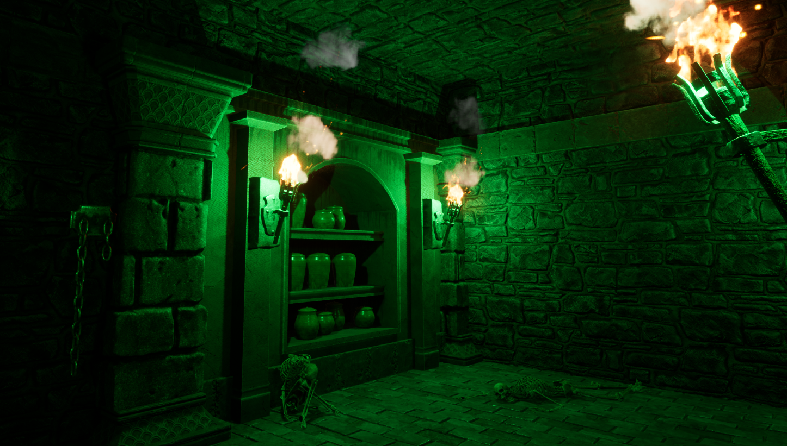

# TreasureRaider
 
## Unreal Engine 5.1 C++ Project
TreasureRaider is the first person dungeon puzzle game.

### Story
A treasure hunter should find a way to get valuable item in the deepest room of the dungeon and he has to run away before time runs out. 
 
 
### Features
- First person character
- Grabber
- Moving Doors. They need items in order to stay open.

### TODO
- Settings Menu
- More complex levels
